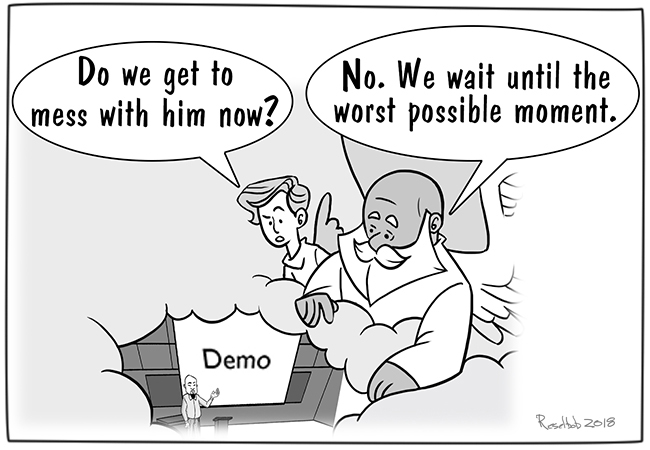
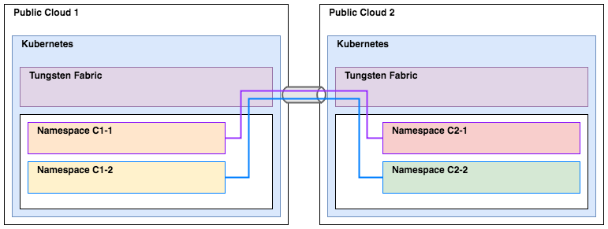
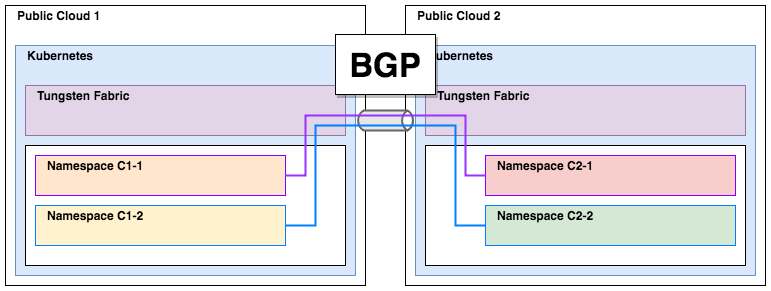

#### KubeCon / Tungsten Fabric Developers Summit

# Multi-Cloud Network Segmentation with Kubernetes and TF

### Will Stevens & Syed Ahmed

December 10th, 2018

---

<!-- .slide: class="dark" -->

# Demo init...
<div class="center-text"></div>

---

#### About CloudOps

CloudOps is a services organization with a simple mission...

> Help our customers own their destiny in the cloud.

In order to realize this mission, we work to:

> Deliver future-proof cloud solutions that leverage open source, key partners and CloudOps software, optimizing how cloud services are delivered, consumed, and connected.

---

## Why Tungsten Fabric

Tungsten Fabric (TF) aligns well with our mission and vision in enabling organizations to consume and manage cloud services.

- **Open source** is a key enabler for organizations to own their destiny.  It provides a level of visibility and control not achievable with proprietary software, and provides the flexibility to extend the platform with community collaboration.
- **Orchestrator integrations** with both OpenStack and Kubernetes (as well as others) creates strong ecosystem alignment which caters to both the existing tooling as well as future-proofing for the next wave of SDN deployments.
- **Service chaining** is an area in the SDN landscape which is not well covered by most implementations.  However, TF stands out in this area with its elegant service chaining implementation.
- A **clean abstraction from the underlay network** enables TF to operate in a wide variety of contexts.

---

## Tungsten Fabric + Kubernetes

Leveraging Tungsten Fabric as a CNI for Kubernetes is a powerful combination, enabling network policies and the ability to extend the Kubernetes networking into other regions or underlay networks.

<div class="center-text"></div>

---

## Let the journey begin...

It turns out that getting Kubernetes and Tungsten Fabric to work together is not trivial, so we wanted to give a little summary of our findings.

The [Deploy Tungsten Fabric on Kubernetes in 1-step command](https://github.com/tungstenfabric/website/blob/master/Tungsten-Fabric-one-line-install-on-k8s.md) tutorial is very useful, but we still ran into these issues.

- We needed the kernel version `3.10.0-862.14.4` instead of `3.10.0-862.3.2`.
- We needed 32GB of RAM and 50GB of disk on the Kubernetes master to have enough resources.
- The *Deploy in 1-step* guide rendered on the website strips out the `sed` variable `{{ K8S_MASTER_IP }}`.

After we are back from KubeCon, I will open a PR to improve the documentation in these areas.

---

## The journey continues...

We also ran into these challenges when deploying Kubernetes and TF together:

- We needed to change the `VROUTER_GATEWAY` variable in the helm chart to be the gateway of the underlay network and not the master IP (which is what is documented), otherwise when TF came up, we would lose network access to the master node.
- We needed to pin the Kubernetes version to `1.10.11`, as version `1.12` does not seem to be supported yet.
- We needed to pin a specific version of `docker` to use in order for everything to come up correctly.

At this point, we were able to consistently deploy Kubernetes and TF together with the ability to launch workloads.

---

## Now the interesting stuff

So now that we can spin up K8s and TF together, we want to deploy two distinct stacks in two different public clouds.

The goal of this is to be able to enable pods in a namespace in one K8s deployment to be able to communicate with a service in a namespace in a K8s deployment in a different cloud.

<div class="center-text"></div>

---

## Bridging the gap

An interesting thing about Tungsten Fabric is that it is a BGP speaker and is able to communicate with other BGP speakers.

Basically, if you have connectivity between two sites in the underlay network, such as a direct connect or a Site-to-Site VPN connection, Tungsten Fabric can route between them.

<div class="center-text"></div>

---

<!-- .slide: class="dark center" -->

# Demo check-in...

---

## Can I use overlapping IP space?

By default, if we spin up both sites the same way, they will have overlapping IP ranges for the `pod`, `service` and `ip-fabric` IPAM ranges.

In attempting to modify the default ranges, we discovered that passing the `--pod-network-cidr` and `--service-cidr` flags to the `kubeadm init` command has mixed results.

The `--service-cidr` flag correctly configures Kubernetes, but the configuration is not propagated to Tungsten Fabric.<br /> *Requires manual intervention...*

The `--pod-network-cidr` flag correctly sets the Kubernetes config, but it seems to have no effect on what is provisioned.<br /> *Requires manual intervention...*

---

## Tungsten Fabric w/ custom IP ranges?

Initial testing of passing in what I expected to be the correct configuration to the `kube-manager-config` ConfigMap did not work.  Admittedly, I did not find documentation on this, so I was guessing...

I expect that having overlapping IP space in the two TF deployments will be a problem, but lets proceed anyway and see if it is a problem.

---

<!-- .slide: class="dark center" -->

# Demo check-in...

---

## Periodically we have problems

Even though all the containers are up and running, sometimes the network does not come up.

Checking the `contrail-status`:

```
== Contrail control ==
control: initializing (No BGP configuration for self)
nodemgr: active
named: active
dns: active
```
and
```
== Contrail vrouter ==
nodemgr: active
agent: initializing (XMPP:control-node:10.177.192.154 connection down, No Configuration for self)
```

Fix by running:
```bash
$ kubectl delete pod contrail-controller-control-<hash> -n kube-system
```